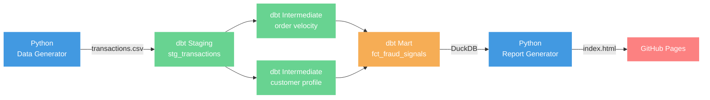

# Ecommerce Fraud Analysis

Detects suspicious ecommerce transactions using a fully local, reproducible data pipeline built with Python, dbt Core, and DuckDB. Results are published automatically to GitHub Pages on every push.

## Architecture



## Fraud Signals

Each order is scored across 8 rules. Orders scoring 50+ are flagged.

| Rule | Points |
|---|---|
| Order amount ≥ $150 | +20 |
| Billing country ≠ shipping country | +25 |
| IP country ≠ billing country | +25 |
| New customer + crypto payment | +30 |
| New customer + order ≥ $100 | +20 |
| High velocity (3+ orders/day) | +20 |
| Gift card purchase | +15 |
| Late-night order (1am–5am) | +10 |

**Risk tiers:** high (≥80) · medium (50–79) · low (25–49) · none (<25)

## Stack

| Tool | Role |
|---|---|
| Python + pandas | Synthetic data generation, report rendering |
| dbt Core | Data transformation, testing, lineage |
| DuckDB | Local analytical database (no server needed) |
| Jinja2 | HTML report templating |
| GitHub Actions | CI — runs full pipeline on every push |
| GitHub Pages | Hosts the fraud report |

## Project Layout

```
├── scripts/
│   ├── generate_transactions.py   # synthetic data generator
│   └── generate_report.py         # HTML report from DuckDB
├── models/
│   ├── staging/                   # type casting, raw flag derivation
│   ├── intermediate/              # velocity + customer risk profile
│   └── marts/                     # final scored fraud signals table
├── data/                          # raw CSV and DuckDB file (git-ignored)
├── reports/                       # generated HTML (git-ignored, deployed by CI)
├── profiles.yml                   # dbt DuckDB connection
└── .github/workflows/pipeline.yml # CI/CD
```

## Running locally

```bash
python -m venv .venv && source .venv/bin/activate
pip install -r requirements.txt
python scripts/generate_transactions.py
dbt build --profiles-dir .
python scripts/generate_report.py
# open reports/index.html in a browser
```