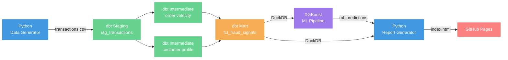

# Ecommerce Fraud Analysis

Detects suspicious ecommerce transactions using a fully local, reproducible data pipeline built with Python, dbt Core, and DuckDB. Results are published automatically to GitHub Pages on every push.

**[Live Report](https://ashrafulhaqove.github.io/ecommerce-fraud-analysis)**

## Architecture



## Fraud Signals

Each order is scored across 8 rules. Orders scoring 50+ are flagged.

| Rule | Points |
|---|---|
| IP country ≠ billing country | +25 |
| Billing country ≠ shipping country | +25 |
| New account (age < 30 days) | +30 |
| Order amount ≥ $150 | +20 |
| New customer + order ≥ $100 | +20 |
| High velocity (3+ orders/day) | +20 |
| Travel category purchase | +15 |
| Late-night order (1am–5am) | +10 |

**Risk tiers:** high (≥80) · medium (50–79) · low (25–49) · none (<25)

## ML Model

XGBoost trained on the rule-scored feature set, with `scale_pos_weight` to handle class imbalance (~3.5% fraud rate).

| Metric | Rule baseline | XGBoost |
|---|---|---|
| ROC-AUC | 0.631 | **0.881** |
| Average Precision | 0.052 | **0.335** |
| F1 | 0.093 | **0.248** |

Model selection notebooks in [`analysis/`](analysis/) cover EDA, class imbalance handling (SMOTE vs class weights), and SHAP feature importance.

## Development Process

The project was built in two major versions across six phases.

### v1 — Rule-Based Pipeline

**Phase 1 — Foundation**
Set up a Python virtual environment, generated a synthetic transactions CSV (500 rows, 12 fields), and connected dbt Core to a local DuckDB file. Established the project skeleton: staging → intermediate → mart layer.

**Phase 2 — Data Modelling**
Built three dbt model layers. Staging casts raw types. Two intermediate models compute order velocity per customer per day and a customer risk profile (avg amount, order count, account age). The mart model `fct_fraud_signals` applies 8 weighted rules to produce a `risk_score` and a `fraud_flag`. 24 automated schema tests validate every model on every run.

**Phase 3 — Dashboard**
Wrote `generate_report.py` to query DuckDB and render a self-contained HTML report via Jinja2 — no external dependencies, works on GitHub Pages as-is. Includes KPI cards, a donut chart for risk tier distribution, fraud signal hit counts with progress bars, and a filterable flagged orders table with CSV export.

**Phase 4 — CI/CD**
Configured GitHub Actions to run the full pipeline on every push to `main` — generate data → `dbt build` → generate report → deploy to GitHub Pages. The DuckDB file and report are never committed; they are always built fresh in CI.

---

### v2 — Real Data + ML

**Phase 5 — Real Data & Analysis**
Replaced synthetic data with the IEEE-CIS fraud dataset (590k rows, 3.5% fraud rate). Wrote five analysis notebooks: EDA and class imbalance characterisation → rule-based baseline (AUC 0.631) → SMOTE vs. `class_weight` comparison → model selection across four algorithms → SHAP feature importance.

**Phase 6 — ML Pipeline & Release**
Trained an XGBoost classifier locally (`train_model.py`), committed the 832 KB model artifact and `metrics.json`. CI uses `predict.py` — it loads the committed model and writes predictions to DuckDB, avoiding re-training in the cloud. Report updated to surface ML probability scores alongside rule scores. Containerised with Docker for single-command reproducibility. Tagged as `v2.0.0`.

---

## Stack

| Tool | Role |
|---|---|
| Python + pandas | Data preparation, report rendering |
| dbt Core | Data transformation, testing, lineage |
| DuckDB | Local analytical database (no server needed) |
| XGBoost + scikit-learn | ML fraud detection model |
| Jinja2 | HTML report templating |
| Docker | Containerised pipeline (single `docker compose up`) |
| GitHub Actions | CI — runs full pipeline on every push |
| GitHub Pages | Hosts the fraud report |

## Project Layout

```
├── analysis/
│   ├── 01_eda.ipynb               # class imbalance, distributions, rule precision/recall
│   ├── 02_baseline.ipynb          # rule-based benchmark
│   ├── 03_imbalance.ipynb         # SMOTE vs class_weight comparison
│   ├── 04_model_selection.ipynb   # XGBoost vs RF vs LR vs HistGBM
│   └── 05_shap.ipynb              # SHAP feature importance
├── scripts/
│   ├── generate_transactions.py   # synthetic data generator
│   ├── train_model.py             # XGBoost training (run locally on real data)
│   ├── predict.py                 # loads committed model, writes ml_predictions to DuckDB
│   └── generate_report.py         # HTML report from DuckDB
├── models/
│   ├── staging/                   # type casting, raw flag derivation
│   ├── intermediate/              # velocity + customer risk profile
│   ├── marts/                     # final scored fraud signals table
│   ├── xgboost_fraud.pkl          # committed trained model (832 KB)
│   └── metrics.json               # training metrics
├── data/                          # raw CSV and DuckDB file (git-ignored)
├── reports/                       # generated HTML (git-ignored, deployed by CI)
├── Dockerfile                     # containerised pipeline
├── profiles.yml                   # dbt DuckDB connection
└── .github/workflows/pipeline.yml # CI/CD
```

## Running locally

**With Docker (recommended)**

```bash
docker compose up
# open reports/index.html in a browser
```

The container runs the full pipeline (generate → dbt build → predict → report) and writes `reports/index.html` to your local `reports/` directory via a volume mount.

**Without Docker**

```bash
python -m venv .venv && source .venv/bin/activate
pip install -r requirements.txt
python scripts/generate_transactions.py
dbt build --profiles-dir .
python scripts/predict.py        # loads committed model, writes predictions
python scripts/generate_report.py
# open reports/index.html in a browser
```

To retrain from scratch on new data, run `python scripts/train_model.py` instead of `predict.py`.

> **Note on model storage:** The trained model (`models/xgboost_fraud.pkl`) is committed directly — it is 832 KB, well within Git's limits. For larger models (>100 MB) the standard approach is [DVC](https://dvc.org/) with a remote backend (S3, Google Drive, etc.), which stores only a small pointer file in Git and the actual artifact in object storage.