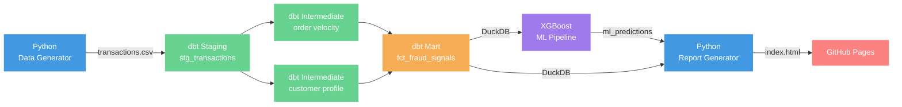

# Ecommerce Fraud Detection Pipeline


[](https://ashrafulhaqove.github.io/ecommerce-fraud-analysis)


End-to-end fraud detection pipeline combining a rule engine with a trained XGBoost classifier. The model was trained on 590,000 real transactions from the IEEE-CIS dataset (3.5% fraud rate) and achieves a ROC-AUC of **0.881** — a **40% improvement** over the rule-only baseline. A GitHub Actions workflow runs the full pipeline on every push and publishes an interactive report to GitHub Pages automatically.

**[Live Report →](https://ashrafulhaqove.github.io/ecommerce-fraud-analysis)**

## Architecture



## Fraud Detection

Fraud detection runs in two independent layers: a rule engine scores every order, and an XGBoost model makes a separate probability estimate from the underlying transaction features.

### Rule Engine

Each order is scored across 8 rules. Orders scoring 50+ are flagged.

| Rule | Points |
|---|---|
| IP country ≠ billing country | +25 |
| Billing country ≠ shipping country | +25 |
| New account (age < 30 days) | +30 |
| Order amount ≥ $150 | +20 |
| New customer + order ≥ $100 | +20 |
| High velocity (3+ orders/day) | +20 |
| Travel category purchase | +15 |
| Late-night order (1am–5am) | +10 |

**Risk tiers:** high (≥80) · medium (50–79) · low (25–49) · none (<25)

### ML Model

XGBoost trained on transaction features from the dbt pipeline — order amount, order hour, account age, daily order velocity, customer average order amount, IP/country mismatch flags, payment method, and product category. `scale_pos_weight` handles the class imbalance without oversampling.

| Metric | Rule baseline | XGBoost |
|---|---|---|
| ROC-AUC | 0.631 | **0.881** |
| Average Precision | 0.052 | **0.335** |
| F1 | 0.093 | **0.248** |

Top SHAP features: Electronics category, account age, customer avg order amount, order amount, daily order velocity.

### Analysis Notebooks

Five notebooks in [`analysis/`](analysis/) document every modelling decision:

| Notebook | What it covers |
|---|---|
| `01_eda` | Class imbalance, distributions, rule precision/recall |
| `02_baseline` | Rule-based AUC benchmark to beat |
| `03_imbalance` | SMOTE vs. `class_weight='balanced'` — why class weights won |
| `04_model_selection` | XGBoost vs. Random Forest vs. Logistic Regression vs. HistGBM |
| `05_shap` | SHAP feature importance on the winning model |

## Development Process

Built in two versions across six phases.

### v1 — Rule-Based Pipeline

**Phase 1 — Foundation**
Set up a Python virtual environment, generated a synthetic transactions CSV (500 rows, 12 fields), and connected dbt Core to a local DuckDB file. Established the staging → intermediate → mart layer structure.

**Phase 2 — Data Modelling**
Built three dbt model layers. Staging casts raw types and derives country/IP mismatch flags. Two intermediate models compute per-customer daily order velocity and a customer risk profile (avg amount, order count, account age, IP mismatch history). The mart model `fct_fraud_signals` applies 8 weighted rules to produce a `risk_score`, `fraud_flag`, and `risk_tier`. 24 automated schema tests validate every model on every run.

**Phase 3 — Dashboard**
Wrote `generate_report.py` to query DuckDB and render a self-contained HTML report via Jinja2 — no external dependencies, works on GitHub Pages as-is. Includes KPI cards, a donut chart for risk tier distribution, fraud signal hit rates with progress bars, and a filterable flagged-orders table with CSV export.

**Phase 4 — CI/CD**
Configured GitHub Actions to run the full pipeline on every push to `main` — generate data → `dbt build` → predict → generate report → deploy to GitHub Pages. The DuckDB file and report are never committed; they are always built fresh in CI.

---

### v2 — Real Data + ML

**Phase 5 — Real Data & Analysis**
Replaced synthetic training data with the IEEE-CIS fraud dataset (590k rows, 3.5% fraud rate). Wrote `prepare_data.py` to reshape the raw dataset into the project schema. Five analysis notebooks cover EDA, rule-based benchmarking, class imbalance handling, model selection across four algorithms, and SHAP feature importance.

**Phase 6 — ML Pipeline & Release**
Trained an XGBoost classifier locally (`train_model.py`), committed the 832 KB model and `metrics.json`. CI uses `predict.py` — it loads the committed model and writes predictions to DuckDB, keeping the cloud build fast and metrics stable. Containerised with Docker for single-command reproducibility. Tagged as `v2.0.0`.

---

## Stack

| Tool | Role |
|---|---|
| Python + pandas | Data preparation, ML pipeline, report rendering |
| dbt Core | SQL transformations, testing, lineage |
| DuckDB | Embedded analytical database (no server required) |
| XGBoost + scikit-learn | Fraud detection model, evaluation |
| SHAP | Model explainability |
| Jinja2 | HTML report templating |
| Docker | Containerised pipeline (`docker compose up`) |
| GitHub Actions | CI — runs full pipeline on every push |
| GitHub Pages | Hosts the live fraud report |

## Project Layout

```
├── analysis/
│   ├── 01_eda.ipynb               # class imbalance, distributions, rule precision/recall
│   ├── 02_baseline.ipynb          # rule-based benchmark
│   ├── 03_imbalance.ipynb         # SMOTE vs class_weight comparison
│   ├── 04_model_selection.ipynb   # XGBoost vs RF vs LR vs HistGBM
│   └── 05_shap.ipynb              # SHAP feature importance
├── scripts/
│   ├── generate_transactions.py   # synthetic data generator (used by CI and Docker)
│   ├── prepare_data.py            # reshapes IEEE-CIS dataset for local training
│   ├── train_model.py             # XGBoost training (run locally on real data)
│   ├── predict.py                 # loads committed model, writes predictions to DuckDB
│   ├── generate_report.py         # renders HTML report from DuckDB
│   └── stress_test.py             # validates rules and performance at scale (1k–50k rows)
├── models/
│   ├── staging/                   # type casting, country/IP flag derivation
│   ├── intermediate/              # order velocity + customer risk profile
│   ├── marts/                     # final scored fraud signals table
│   ├── xgboost_fraud.pkl          # committed trained model (832 KB)
│   └── metrics.json               # training metrics (loaded by CI, shown in live report)
├── data/                          # raw CSV and DuckDB file (git-ignored, built at runtime)
├── reports/                       # generated HTML (git-ignored, deployed by CI)
├── Dockerfile                     # containerised pipeline
├── docker-compose.yml             # single-command local run
├── profiles.yml                   # dbt DuckDB connection
└── .github/workflows/pipeline.yml # CI/CD
```

## Running Locally

### With Docker (recommended)

> **Mac users:** requires [Colima](https://github.com/abiosoft/colima) (`colima start`) or Docker Desktop before running.

```bash
docker compose up
# open reports/index.html in your browser
```

The container runs the full pipeline using synthetic data (generate → dbt build → predict → report) and writes `reports/index.html` to your local `reports/` directory via a volume mount.

### Without Docker

```bash
python -m venv .venv && source .venv/bin/activate
pip install -r requirements.txt
python scripts/generate_transactions.py
dbt build --profiles-dir .
python scripts/predict.py
python scripts/generate_report.py
# open reports/index.html in your browser
```

### Retraining on real data

The committed model was trained on the [IEEE-CIS Fraud Detection](https://www.kaggle.com/competitions/ieee-fraud-detection) dataset. To retrain locally, download `train_transaction.csv` and `train_identity.csv` from Kaggle, place them in `data/raw/`, then:

```bash
python scripts/prepare_data.py   # reshape IEEE-CIS → transactions.csv
dbt build --profiles-dir .
python scripts/train_model.py    # train and save models/xgboost_fraud.pkl
python scripts/generate_report.py
```

> **Note on model storage:** The trained model (`models/xgboost_fraud.pkl`) is committed directly at 832 KB. For larger models (>100 MB) the standard approach is [DVC](https://dvc.org/) with a remote backend (S3, Google Drive, etc.).